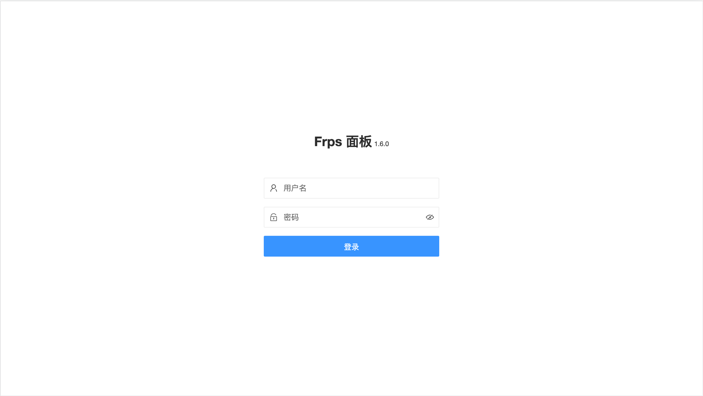

# frps-panel(支持 FRP >= 0.52.0)  
go build -o ./bin/frps-panel ./cmd/frps-panel
frps-panel.exe -c ./frps-panel.toml 
windows：
$env:CGO_ENABLED="0"; $env:GOOS="windows"; $env:GOARCH="amd64"; go build -ldflags "-s -w" -o ./release/frps-panel-windows-amd64.exe ./cmd/frps-panel
Linux：
 $env:CGO_ENABLED="0"; $env:GOOS="linux"; $env:GOARCH="amd64"; go build -ldflags "-s -w" -o ./release/frps-panel-linux-amd64 ./cmd/frps-panel

[README](README.md) | [中文文档](README_zh.md)

frps-panel 是 [frp](https://github.com/fatedier/frp) 的一个服务端插件，用于查看服务器信息以及支持多用户鉴权。

frps-panel 会以一个单独的进程运行，并接收 frps 发送过来的 HTTP 请求。

## 从版本2.0.0开始，本插件只支持版本号大于等于v0.52.0的frp





### 功能

+ **支持展示服务器信息**
+ **支持多用户鉴权**
+ **动态`添加`、`删除`、`禁用`、`启用`用户**
+ **对用户的`端口`、`域名`、`二级域名`进行限制**

***用户被`删除`或`禁用`后，不会马上生效，需要等一段时间***

***用户`端口`、`域名`、`二级域名`限制仅在建立新连接(`NewProxy`)时生效***

### 下载

通过 [Release](../../releases) 页面下载对应系统版本的二进制文件到本地。

### 要求

需要 frp 版本 >= v0.52.3

### 使用示例

1. 创建 `frps-panel.toml` 文件，内容为基础配置。

```toml
# frps-panel.toml
[common]
# frps panel config info
plugin_addr = "127.0.0.1"
plugin_port = 7200
#admin_user = "admin"
#admin_pwd = "admin"
# specified login state keep time
admin_keep_time = 0

# enable tls
tls_mode = false
# tls_cert_file = "cert.crt"
# tls_key_file = "cert.key"

# frp dashboard info
dashboard_addr = "127.0.0.1"
dashboard_port = 7500
dashboard_user = "admin"
dashboard_pwd = "admin"
```

2. 创建`frps-tokens.toml`文件，其内容为系统中的用户，该文件位置和`frps-panel.toml`相同。如不创建此文件，在增加用户时会自动创建。

```toml
#frps-tokens.toml
[tokens]
   [tokens.user1]
      user = "user1"
      token = "token1"
      comment = "user1 with token1"
      ports = [8080, "10000-10200"]
      domains = ["web01.domain.com", "web02.domain.com"]
      subdomains = ["web01", "web02"]
      enable = true
   [tokens.user2]
      user = "user2"
      token = "token2"
      comment = "user2 with token2"
      ports = [9080]
      domains = ["web11.domain.com", "web12.domain.com"]
      subdomains = ["web11", "web12"]
      enable = false
```

3. 运行 frps-panel，指定配置文件路径。

    `./frps-panel -c ./frps-panel.toml`

4. 在 frps 的配置文件中注册插件，并启动。

```toml
# frps.toml
bindPort = 7000

[[httpPlugins]]
name = "frps-panel"
addr = "127.0.0.1:7200"
path = "/handler"
ops = ["Login","NewWorkConn","NewUserConn","NewProxy","Ping"]
```

5. 在 frpc 中指定用户名，在 metadatas 中指定 token，用户名以及 `metadatas.token` 的内容需要和之前创建的 token 文件匹配。

    user1 的配置:

```toml
# frpc.toml
serverAddr = "127.0.0.1"
serverPort = 7000
user = "user1"
metadatas.token = "123"

[[proxies]]
type = "tcp"
localIP = 22
localPort = 8080
```
或
```toml
# frpc.toml
serverAddr = "127.0.0.1"
serverPort = 7000
user = "user1"
[metadatas]
token = "123"

[[proxies]]
type = "tcp"
localIP = 22
localPort = 8080
```

    user2 的配置:（由于示例文件中user2被禁用，因此无法连接）

```toml
# frpc.toml
serverAddr = "127.0.0.1"
serverPort = 7000
user = "user2"
metadatas.token = "abc"

[[proxies]]
type = "tcp"
local_port = 22
remote_port = 6000
```
或
```toml
# frpc.toml
serverAddr = "127.0.0.1"
serverPort = 7000
user = "user2"
[metadatas]
token = "abc"

[[proxies]]
type = "tcp"
local_port = 22
remote_port = 6000
```

6.浏览器中输入地址: http://127.0.0.1:7200 或 https://127.0.0.1:7200 进入管理页面进行用户管理

## 以服务的形式运行

本实例是在 `ubuntu` 下， 以 `root` 用户执操作

+ 1、解压 `frps-panel.zip` 到目录 `/root/frps-panel`
+ 2、在目录 `/root/frps-panel` 下 用命令创建文件：`touch frps-panel.service`。创建后修改文件内容：
```ini
[Unit]
Description = frp multiuser service
After = network.target syslog.target
Wants = network.target

[Service]
Type = simple
# 启动frps-panel的配置文件路径，需修改为您的frps-panel.toml的路径
Environment=FRPS_PANEL_OPTS="-c /root/frps-panel/frps-panel.toml"
# 启动frps-panel的命令，需修改为您的frps-panel的安装路径
ExecStart = /root/frps-panel/frps-panel $FRPS_PANEL_OPTS

[Install]
WantedBy = multi-user.target
```
+ 3、复制服务文件： `cp /root/frps-panel.service /etc/systemd/system/`
+ 4、重载服务： `systemctl daemon-reload`
+ 5、启动服务： `service frps-panel start`

## 使用

___如果要从外网访问管理界面, 需要把配置中的 `plugin_addr` 改为 `0.0.0.0`___

如果使用中有问题或者有其他想法，在[issues](https://github.com/yhl452493373/frps-panel/issues)上提出来。 如果我能搞定的话，我尽量搞。

## 致谢

+ [frp](https://github.com/fatedier/frp)
+ [fp-multiuser](https://github.com/gofrp/fp-multiuser)
+ [layui](https://github.com/layui/layui)
+ [layui-theme-dark](https://github.com/Sight-wcg/layui-theme-dark)
+ [echarts](https://github.com/apache/echarts)
